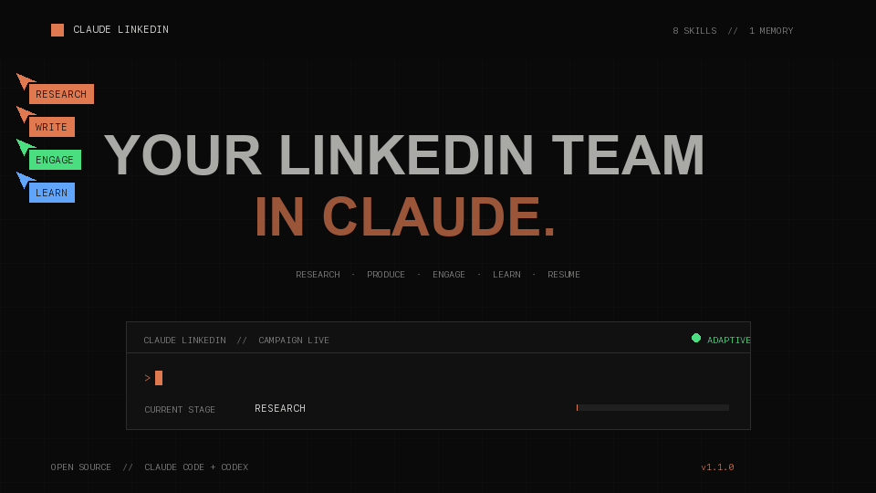

<h1 align="center">Claude LinkedIn</h1>

<p align="center"><strong>Your LinkedIn team in Claude.</strong></p>

<p align="center">
  <a href="https://github.com/sunny-chandel/linkedin-campaign-operator/actions/workflows/ci.yml"></a>
  <a href="https://github.com/sunny-chandel/linkedin-campaign-operator/releases/latest"></a>
  <a href="LICENSE"></a>
</p>

<p align="center">
  <a href="https://linkedin-campaign-operator.sunnychandel73.chatgpt.site/"></a>
</p>

<p align="center">
  <a href="https://linkedin-campaign-operator.sunnychandel73.chatgpt.site/"><strong>Explore the live system →</strong></a>
  &nbsp;·&nbsp;
  <a href="#install-in-claude-code"><strong>Install for Claude Code →</strong></a>
</p>

Claude LinkedIn is the public interface for LinkedIn Campaign Operator: a free, open-source collection of Agent Skills for researching topics, writing LinkedIn posts, planning thoughtful engagement, publishing at evidence-based times, measuring results, and carrying campaign learning across sessions.

**Website:** [linkedin-campaign-operator.sunnychandel73.chatgpt.site](https://linkedin-campaign-operator.sunnychandel73.chatgpt.site)

Version 6.0.0-rc.26 makes clean startup and continuation script-driven while keeping model context compact. The initializer returns explicit local campaign and profile-verification contracts, the owner start receipt never expands into future LinkedIn account activity, every task transition is recorded through one runtime command, and one deduplicated recurring Claude Desktop Routine is created once. A read-only due gate makes early routine checks exit without changing state, and later waits never update the recurring schedule. Child prompts receive only the current task and verified evidence, not raw runtime diagnostics or unrelated chat history.

It supports Claude Code and Codex as independent hosts, keeps mutable campaign data outside the plugin, and resumes from verified state instead of starting over every day. The Claude runtime does not depend on Codex.

## What it does

- researches fresh topics and verifies public claims;
- produces posts, creative briefs, and publication packages;
- ranks engagement opportunities by predicted value;
- operates an adaptive work queue across content, engagement, and analytics;
- tracks followers, connections, post performance, and experiments;
- builds a reusable profile-derived brand and watermark system;
- discovers included premium features and routes useful ones into the workflow;
- stores state, logs, decisions, and learning in auditable JSON artifacts.

The included 10,000-follower and 10,000-connection strategy is the default. Your identity, profile URL, timezone, niche, baselines, and growth goals are configurable.

## The parent and twelve child skills

| Skill | Role |
| --- | --- |
| `linkedin-campaign-orchestrator` | Governs state, routing, recovery, and next actions |
| `linkedin-opportunity-discovery` | Rotates sources and atomically maintains canonical opportunities |
| `linkedin-engagement-execution` | Builds bursts and enforces rolling action accounting |
| `linkedin-regional-intelligence` | Allocates six regional portfolio slots from evidence |
| `linkedin-publishing-operations` | Maintains package inventory, publication evidence, and analytics schedules |
| `linkedin-runtime-repair` | Restores unhealthy runtime capabilities and resumes work |
| `linkedin-content-research` | Finds topics, sources, and defensible claims |
| `linkedin-content-production` | Creates captions, creative briefs, and publish packages |
| `linkedin-engagement-planning` | Scores and prepares high-value engagement actions |
| `linkedin-analytics-learning` | Compares results and updates runtime learning |
| `linkedin-brand-system` | Maintains profile-derived visual identity assets |
| `linkedin-gif-creative-intelligence` | Learns and specifies effective GIF patterns |
| `linkedin-premium-router` | Maps included LinkedIn features to campaign work |

## Install in Claude Code

```text
/plugin marketplace add sunny-chandel/linkedin-campaign-operator
/plugin install linkedin-campaign-operator-v3@sunny-linkedin-tools
```

Then run:

```text
/linkedin-campaign-operator-v3:linkedin-campaign-orchestrator
```

## Automated startup and recovery

The parent starts the configured organic LinkedIn system. Initial campaign setup stores one campaign-lifetime operating receipt. Later sessions self-revive from durable state, reconcile missed rolling obligations, reuse valid pre-flight evidence, and route automatically through all twelve child skills. Setup uses the campaign state directly rather than a generic form or fixed engagement clusters.

## Install in Codex

```bash
codex plugin marketplace add sunny-chandel/linkedin-campaign-operator
codex plugin add linkedin-campaign-operator-v3@linkedin-campaign-operator
```

Open a new task and ask:

```text
Start my LinkedIn growth campaign.
```

## Initialize campaign state manually

The orchestrator can discover account details from connected Chrome. For a deterministic setup, run:

```bash
python3 plugins/linkedin-campaign-operator-v3/skills/linkedin-campaign-orchestrator/scripts/init_campaign.py \
  campaign-data/linkedin-growth \
  --owner-name "Your Name" \
  --profile-url "https://www.linkedin.com/in/your-handle/" \
  --timezone "Asia/Kolkata" \
  --niche "AI engineering" \
  --followers-goal 10000 \
  --connections-goal 10000
```

Validate it:

```bash
python3 plugins/linkedin-campaign-operator-v3/skills/linkedin-campaign-orchestrator/scripts/validate_campaign.py \
  campaign-data/linkedin-growth
```

## Example prompts

```text
Build today's LinkedIn content and engagement plan.
```

```text
Research two timely AI infrastructure topics and prepare source-backed briefs.
```

```text
Analyze my latest post snapshots and choose the next best campaign action.
```

```text
Resume my campaign from the last verified state and complete the next executable stage.
```

## Development

```bash
python3 -m venv .venv
.venv/bin/pip install pytest pyyaml pillow
.venv/bin/python -m pytest -q
```

For a local Claude Code plugin session:

```bash
claude --plugin-dir /absolute/path/to/linkedin-campaign-operator/plugins/linkedin-campaign-operator-v3
```

See [TESTING.md](TESTING.md) for behavioral acceptance tests and [CONTRIBUTING.md](CONTRIBUTING.md) for the contribution workflow.

## Project structure

```text
plugins/linkedin-campaign-operator-v3/
├── .claude-plugin/plugin.json
├── .codex-plugin/plugin.json
└── skills/
    ├── linkedin-campaign-orchestrator/
    └── twelve automatically routed child skills/
```

Each skill uses the open `SKILL.md` convention, progressive disclosure through focused references, and deterministic helper scripts where repeatability matters.

## License

MIT © Sunny Chandel
